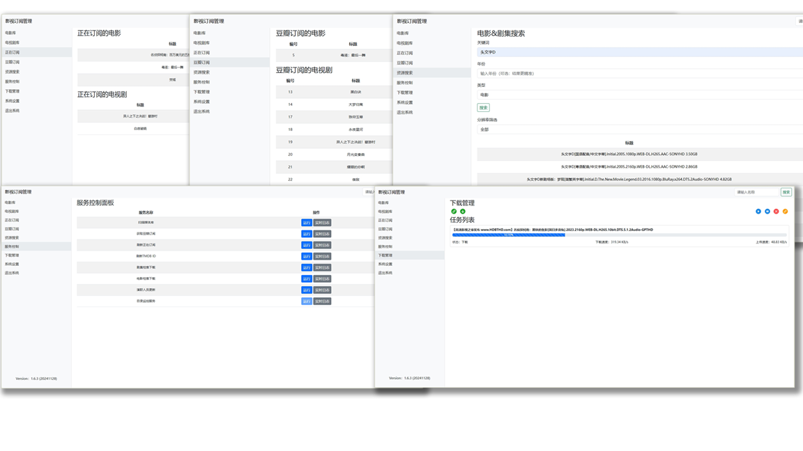

# MediaMaster-universal

## 简介

影视自动化订阅管理系统（通用版）。

**特别说明**

高清剧集网和高清影视之家，需自行注册用户进行测试。

本项目仅用于个人学习研究Python技术使用，请勿用于其他用途。


**管理界面预览：**



## 更新日志

查看 [更新日志](CHANGELOG.md) 以了解每个版本的详细变更记录。

## 许可证

本项目采用 [MIT License](LICENSE) 许可证。详情请参阅 [LICENSE](LICENSE) 文件。

## Docker 仓库地址

本项目Docker仓库： https://hub.docker.com/r/smysong/mediamaster-universal

## 快速开始

### 使用Docker Compose部署：
请替换volumes路径为实际路径。docker.1ms.run是docker镜像代理拉取地址，可以去除或更改为其他代理地址。
WEB管理信息：
> 默认端口：8888 \
> 使用浏览器访问：http://your-ip:8888 \
> 默认用户名：admin \
> 默认密码：P@ssw0rd

**（单独部署） docker-compose.yml 如下：**
```
version: '3.8'
services:
  mediamaster:
    image: docker.1ms.run/smysong/mediamaster-universal
    container_name: mediamaster
    environment:
      - UID=1000
      - GID=100
      - GIDLIST=100
    volumes:
      - /vol1/1000/Downloads:/Downloads
      - /vol1/1000/Torrent:/Torrent
      - /vol1/1000/Docker/mediamaster:/config
      - /vol1/1000/Media:/Media
    ports:
      - 8888:8888
    restart: always
    networks:
      media-network:

networks:
  media-network:
    driver: bridge
    enable_ipv6: true
    ipam:
      config:
        - subnet: 172.16.238.0/24
        - subnet: 2001:db8:1::/64
```
**（包含下载服务）docker-compose.yml 如下：**
```
version: '3.8'
services:
  mediamaster:
    image: docker.1ms.run/smysong/mediamaster-universal:latest
    container_name: mediamaster
    networks:
      media-network:
    environment:
      - UID=1000
      - GID=100
      - GIDLIST=100
    volumes:
      - /vol1/1000/Downloads:/Downloads
      - /vol1/1000/Torrent:/Torrent
      - /vol1/1000/Docker/mediamaster:/config
      - /vol1/1000/Media:/Media
    ports:
      - 8888:8888
    restart: always

  transmission:
    image: docker.1ms.run/linuxserver/transmission:latest
    container_name: transmission
    networks:
      media-network:
    environment:
      - PUID=1000
      - PGID=1000
      - TZ=Etc/UTC
    volumes:
      - /vol1/1000/Docker/transmission:/config
      - /vol1/1000/Downloads:/downloads
      - /vol1/1000/Torrent:/watch
    ports:
      - 9091:9091
      - 51413:51413
      - 51413:51413/udp
    restart: unless-stopped

networks:
  media-network:
    driver: bridge
    enable_ipv6: true
    ipam:
      config:
        - subnet: 172.16.238.0/24
        - subnet: 2001:db8:1::/64
```

### CLI手动部署：
### 步骤 1: 拉取镜像
**首先，你需要从 Docker Hub 拉取镜像。假设你已经在一台安装了 Docker 的机器上：**


```
docker pull smysong/mediamaster-universal:latest
```


这将下载 smysong/mediamaster-universal:latest 镜像到本地。

### 步骤 2: 运行镜像
**接下来，你可以运行这个镜像。需要挂载一些配置文件或数据卷，你需要指定适当的挂载点。以下是一个示例命令，用于运行镜像，并挂载配置文件和数据卷：**


```
docker run -it --name mediamaster \
           -v /path/to/config:/config \
           -v /Media:/Media \
           -v /Torrent:/Torrent \
           -v /Downloads:/Downloads \
           smysong/mediamaster-universal:latest
```

在这个命令中：

> -it \
> 表示以交互模式运行容器，并分配一个伪TTY。
> 
> --name mediamaster \
> 给容器命名。
>  
> -v /path/to/config:/config \
> 在主机上新建config 目录挂载到容器的 /config 目录，用于存放配置文件。
>  
> -v /Media:/Media \
> 将主机上的媒体根目录挂载到容器的/Media目录，用于扫描本地媒体库文件和nfo文件。
>  
> -v /Torrent:/Torrent \
> 在主机上新建Torrent 目录挂载到容器的 /Torrent 目录，用于存放下载的种子文件。
> 
> -v /Downloads:/Downloads \
> 目录监控，将主机上下载器的下载目录挂载到容器/Downloads目录，可以实现自动转移并重命名下载完成的影片文件。
>  
> smysong/mediamaster-universal:latest \
> 是要运行的镜像名称。


**配置config.ini，默认会自动创建配置文件，在WEB管理中自行进行修改或直接修改配置文件。配置文件参数如下：**


```
[database]
db_path = /config/data.db #数据库路径，保持默认即可

[mediadir]
directory = /Media #媒体根目录
movies_path = /Media/Movie #电影目录
episodes_path = /Media/Episodes #电视剧目录

[downloadtransfer]
directory = /Downloads  #下载文件转移监控目录
action = copy  #下载文件转移方式，支持复制（copy）和移动（move）
excluded_filenames = #下载文件转移排除文件名

[douban]
api_key = 0ac44ae016490db2204ce0a042db2916 #豆瓣API，保持默认
cookie = your_douban_cookie_here #豆瓣cookie，选填非必要
rss_url = https://www.douban.com/feed/people/user-id/interests #豆瓣最新想看，更改为自己的user-id

[tmdb]
base_url = https://api.tmdb.org/3 #tmdb-api请求地址，使用默认地址或改为代理地址
api_key = your_api_key #tmdb-api密钥，改为自己的密钥

[download_mgmt]
download_mgmt = True #开启下载管理
download_mgmt_url = http://your_transmission_ip:port #transmission管理IP和端口号

[resources]
login_username = username #高清影视之家和高清剧集网的登录用户名
login_password = password #高清影视之家和高清剧集网的登录密码
preferred_resolution = 2160p #资源首选分辨率
fallback_resolution = 1080p #资源备用分辨率
exclude_keywords = 60帧,高码版 #排除包含此关键字的资源

[urls]
tv_url = https://200.tudoutudou.top     #高清剧集网最新域名
movie_url = https://100.tudoutudou.top  #高清影视之家最新域名

[running]
run_interval_hours = 6 #程序自动运行间隔时长，默认6小时

```

**容器运行成功后可通过日志查看运行情况，并且配置qBittorrent或Transmission 等下载工具监听主机上的torrent目录，发现新的种子文件后将自动下载。**

### 步骤 3: 登录WEB管理
> 默认端口：8888 \
> 容器支持host模式或bridge模式 \
> 使用浏览器访问：http://your-ip:8888 \
> 默认用户名：admin \
> 默认密码：P@ssw0rd
